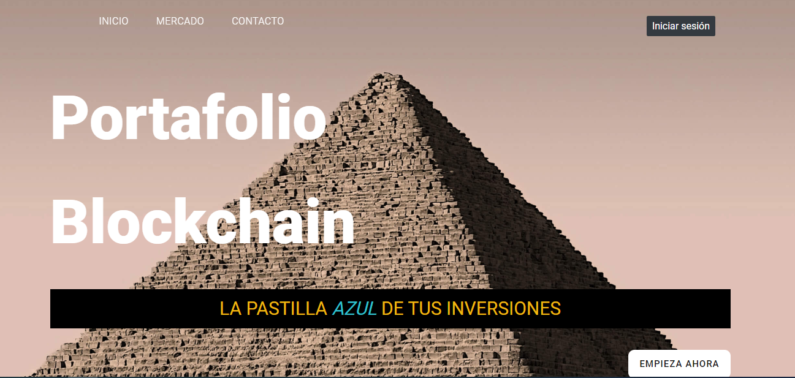

# MIN


### _Tabla de contenidos:_
* **[1]  [Resumen](#resumen-)**
* **[2]  [Estructura del proyecto](#estructura-del-proyecto-)**
* **[3] [Instalación](#instalación-)**
	* **[3.1] [Frontend](#frontend)**
	* **[3.2] [Backend](#backend)**
* **[4]  [Manual](#manual)**
* **[5]  [Autores](#autores-%EF%B8%8F-)**

## Resumen 📋

La idea de la página és desenvolupar una aplicació web para la gestion del mundo de las criptomonedes.

El usuario podrá decidir si quiere utilizar lo que lo podemos ofrecerle registrarse en nuestra página, podrá vincular sus carteras a la página para más tarde si ve momento de hacer una transferencia a otras de las que tiene poder hacer una inversión. 

Para ver como funciona en produccion:
[Front en produccion](https://minventing.herokuapp.com/).  
[Back en produccion](https://afternoon-garden-11284.herokuapp.com/).  

[Jira;](http://labs.iam.cat:8080/projects/DAWSIN1/summary). Pagina con la que hemos hecho el Scrum

[Docs](https://github.com/a18rafgarper/minBack/tree/main/docs).  

## Estructura del proyecto 📐

El proyecto esta construido apartir del stack MEAN que utiliza las tecnologias de Nodejs, Angular, Express y MongoDb

- **Frontend:**  
Hecho con [Angular](https://angular.io/).  

- **Backend**  
Hecho con [Express](https://expressjs.com/).      

- **Base de datos:**   
La base de datos que utiliza es [MongoDb](https://www.mongodb.com/).  


## Instalación 💻

Para poder utilizar el proyecto necesitas el Frontend y el Backend. Para empezar te clonas nuestros repositorios e instalas el [Node.js](https://nodejs.org/es/)

### Frontend

[Repositorio Front](https://github.com/Rafael3994/Frontend_MIN)
Con el proyecto del frontend clonado, abres la carpeta de este, abres la terminal y escribes estos comandos:

```> npm install```   
```> npm install -g @angular/cli```   
```> ng serve```   

### Backend

[Repositorio Back](https://github.com/Rafael3994/Backend_MIN)
Con el proyecto del backend clonado, abres la carpeta de este, abres la terminal y escribes estos comandos:

```> npm install```   
```> npm install express```   
```> npm run dev```    

### Manual

Bienvenido al manual de la página MIN, aquí podrás documentarte de las administraciones que puedes tener con este sitio web.

Cuando accedas por primera vez a la página podrás ver un menú con accesos rápidos que navegan por todo el home.
Podrás iniciar sesión o en caso de que no tengas una sesión podrás registrarte. Dependiendo a qué botón le des, iras redirigido a un formulario para poner tus datos.

Cuando estés registrado tendrás acceso a tres botones nuevos, donde con ellos puedes gestionar tu cuenta. El botón cerrar seción que hace lo que el mismo nombre indica, añadir cartera, que al clicar te enviara a un formulario donde agregaras tu cartera y verás todas las carteras que son de tu propiedad. Y finalmente el botón de nuevo movimiento que hace que puedas añadir movimientos nuevos a tu cuenta.


## Autores ✒️

- **Arnau Fernandez Jerez**   
    a18arnferjer@inspedralbes.cat   

- **Pau Callejas Tovar**  
    a18paucaltov@inspedralbes.cat

- **Rafael Garica Perez**  
    [rafael3994](https://github.com/Rafael3994)

